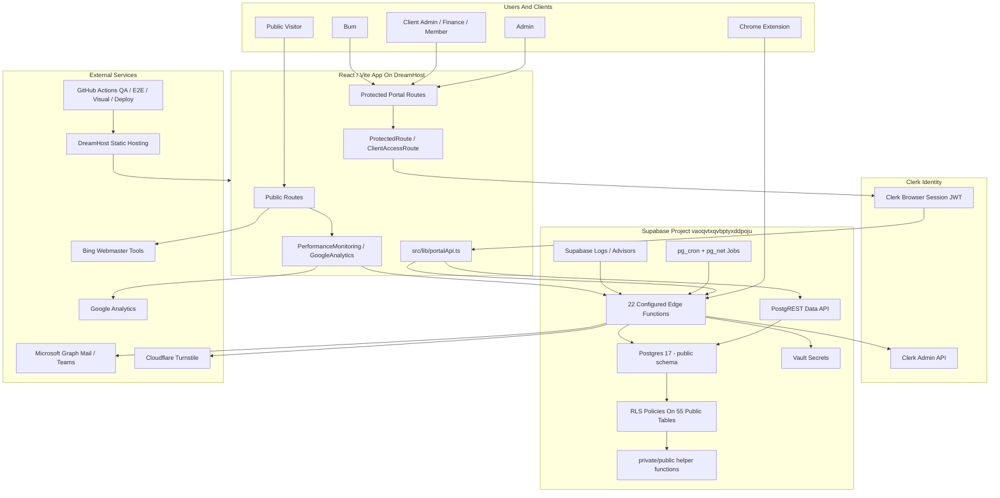
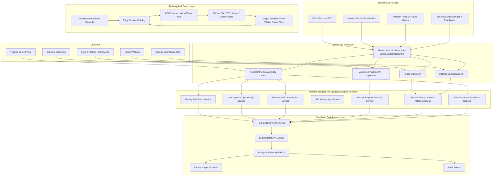

# Trusted Bums Technology Architecture Backlog

_Last updated: 2026-06-12 by Codex Technology Architect Agent._

## Architecture Thesis

Trusted Bums has a workable platform foundation: React/Vite frontend, Clerk identity, Supabase Postgres with RLS on all public tables, Supabase Edge Functions for privileged workflows, GitHub Actions for QA/release evidence, DreamHost for the public app, Microsoft Graph for operations mailbox/Teams workflows, and a first versioned partner-like API for the Chrome extension.

The main architecture risk is not that the stack is wrong. The risk is boundary drift. The portal still mixes direct Supabase Data API access, browser route guards, RLS policies, service-role Edge Functions, and one documented OpenAPI surface without a clear rule for which workflow belongs where. As Trusted Bums adds Clients, Bums, partners, finance workflows, mailbox automation, and browser extension capabilities, the platform needs an explicit API/access/service strategy before the current pattern becomes harder to validate and safely extend.

## Current Drawing

## Proposed Drawing

## Current Platform Map

### Supabase Infrastructure

- Live project: `Trusted Bums`, project ref `vaoqvtxqvbptyxddpoju`, URL `https://vaoqvtxqvbptyxddpoju.supabase.co`, region `us-west-2`, status `ACTIVE_HEALTHY`, Postgres `17.6.1.111`.
- Live catalog: `55` public tables, `1` public view, `23` auth tables, `8` storage tables.
- RLS: all `55` public tables have RLS enabled.
- Grants: live catalog still shows broad `anon` and `authenticated` table privileges across nearly all public objects. RLS is doing the real filtering, but grants keep the Data API object surface broad.
- Functions: `22` Edge Functions are configured in `supabase/config.toml`; `23` function folders exist under `supabase/functions` excluding `_shared`, including one dormant/non-configured `clerk-impersonation` folder. Most source config entries use `verify_jwt = false` because the app verifies Clerk sessions or internal secrets inside handlers.
- Scheduled work: `pg_cron`, `pg_net`, `pg_stat_statements`, `supabase_vault`, `pgcrypto`, `uuid-ossp`, and `plpgsql` are enabled. Three active cron jobs call Edge Functions for Teams transcripts, Teams attendees, and claim-decision replies using Vault-backed project URL/key/secret values.
- Advisors: live security advisors flag `normalize_customer_domain` missing an explicit search path, public/signed-in executable `SECURITY DEFINER` helpers, and Supabase Auth leaked-password protection disabled. Performance advisors still flag unindexed foreign keys and multiple permissive RLS policies on route-adjacent tables.

### Auth Architecture

- Clerk is the product identity provider. The frontend uses `@clerk/react`, Clerk session state, and `session.getToken()` / `session.getToken({ template: "supabase" })`.
- Supabase is configured for third-party Clerk auth in `supabase/config.toml` under `[auth.third_party.clerk]`.
- `src/lib/supabase.ts` sends Clerk tokens through `createClient(..., { accessToken })` and falls back between current session token and legacy Supabase template token on `401`.
- `AuthContext` calls `profile-bootstrap`, loads the Trusted Bums `profiles` row, and treats role/access status from the database as the portal authorization source. Browser route guards then enforce Admin, Client, Bum, and Client access-role screens.
- Edge Functions that use service-role keys generally re-verify the Clerk bearer token in-function, resolve `profiles`, then perform privileged writes or external calls.

### API Strategy

- The strongest API boundary today is the Chrome extension: `docs/openapi.yaml`, `docs/api.md`, and `supabase/functions/extension-api-v1/index.ts` define a versioned contract using Clerk bearer tokens.
- Portal code still uses `src/lib/portalApi.ts` as a broad client-side API helper over direct Supabase tables, RPCs, and Edge Functions.
- Public intake and trusted workflows are implemented as individual Edge Functions such as `submit-contact`, `send-website-email`, `profile-bootstrap`, `client-team`, `portal-contacts`, `send-admin-email`, `admin-access-requests`, `admin-shared-mailbox`, and `api-access-keys`.
- There is not yet a written rule that decides when a new workflow should be direct Data API, a role-scoped RPC/view, a portal BFF/domain Edge Function, an internal operations function, or a partner-facing OpenAPI endpoint.

### Microservices Architecture

- Trusted Bums does not need separate independently hosted microservices yet. Supabase Edge Functions already act as modular service boundaries.
- Current function inventory naturally groups into services:
  - Identity/team: `profile-bootstrap`, `client-team`, `admin-access-requests`, `sync-clerk-users`, `clerk-user-tools`.
  - API access and partner capture: `api-access-keys`, `extension-api-v1`, `portal-contacts`, `invite-bum`, `bum-extension-download`.
  - Communications/operations: `admin-shared-mailbox`, `send-admin-email`, `send-website-email`, `email-track`, `submit-feedback`.
  - Microsoft workflow sync: `schedule-teams-meeting`, `sync-teams-attendees`, `sync-teams-transcripts`, `sync-claim-decision-replies`, `dmarc-reports`.
  - Observability: `performance-beacon`.
- The missing layer is service governance: shared auth helpers, service catalog, owner/runbook, contract tests, deployment provenance, and per-service allow/deny test coverage.

### Partner Architecture Strategy

- Current external/partner-like surface: Chrome extension API, intentionally user-confirmed and draft-first.
- Current internal integrations: Microsoft Graph, DMARC reports, Teams meetings/transcripts/attendees, Google Analytics, Bing Webmaster Tools, Cloudflare Turnstile, Clerk Admin API, GitHub Actions, DreamHost deploy.
- Future partner strategy should not expose raw Supabase tables. It should use versioned Edge API namespaces, explicit partner onboarding, partner-scoped credentials or future OAuth, rate limits, data minimization, OpenAPI contracts, audit events, and deprecation/version policy.

## Active Architecture Recommendations

### P1 - [TB-0087] Narrow Supabase Data API exposure and privileged helper grants
- Affected systems: Supabase public schema grants, RLS, helper functions, Data API, security advisors, QA allow/deny tests.
- Affected roles or workflows: Admin, Client Admin, Client Finance, Client Member, Bum, Public Visitor, browser extension, all Edge Functions using service-role paths.
- Evidence: Live Supabase SQL confirms all `55` public tables have RLS enabled, but `anon` has `SELECT`, `UPDATE`, `DELETE`, `TRUNCATE`, `TRIGGER`, and `REFERENCES` on `56` public relations and `INSERT` on `55`; `authenticated` has the same broad privileges. Live security advisors flag public and signed-in executable `SECURITY DEFINER` functions for `find_customer_lead_duplicate`, `record_admin_scrum_item_audit_event`, and `set_admin_scrum_item_audit_fields`, plus missing explicit `search_path` on `normalize_customer_domain`.
- Architecture risk: RLS is currently the primary safety layer, but object-level API exposure is broad. As the schema grows, each new table/function can become reachable before the intended API boundary is clear.
- Recommendation: Move toward explicit Data API grants by workflow. Revoke broad default grants where safe, keep helper functions in a private schema when possible, remove public/signed-in EXECUTE from trigger-only or internal helpers, set explicit function search paths, and pair each change with positive/negative role tests.
- Cross-specialist handoffs: Security, QA/Test, QA Harness, Data, Product Ops, Lead Developer, Code Review.
- Validation plan: Use Supabase advisors before/after; query grants and helper EXECUTE privileges; run role allow/deny tests for Admin, Client Admin, Client Finance, Client Member, Bum, and Public Visitor; run hosted E2E smoke plus targeted direct Data API tests.
- Migration or rollback notes: Do this by table/function group, starting with advisor-flagged helpers and highest-sensitivity finance/email/admin tables. Use reversible migrations and a hold-deploy trigger if legitimate portal reads/writes fail.
- Acceptance criteria: Advisor warnings for public/signed-in `SECURITY DEFINER` helper execution are cleared or explicitly waived; default grants are intentionally narrowed for new objects; no direct browser workflow depends on unnecessary object privileges; QA proves legitimate workflows still work and disallowed cross-role access is denied.

### P1 - [TB-0089] Catalog Edge Functions as domain services with shared auth controls
- Affected systems: Supabase Edge Functions, `supabase/config.toml`, service-role secrets, Clerk verification logic, cron jobs, deployment process, logs.
- Affected roles or workflows: Admin access review, client team management, extension capture, contact intake, email sending/tracking, Teams sync, claim decision replies, DMARC review, performance telemetry.
- Evidence: Source inventory at `dc9bd01` shows `22` configured Edge Functions in `supabase/config.toml` and `23` function folders excluding `_shared`. The current merge added `admin-shared-mailbox` and `api-access-keys`, both service-role functions with in-handler Clerk issuer verification and role checks. Source config sets most functions to `verify_jwt = false`; live inventory must be refreshed to prove deployed config matches source. Function source repeats Clerk bearer parsing, profile lookups, CORS, and service-role client creation across handlers. Cron jobs invoke internal sync functions using Vault-backed secrets.
- Architecture risk: The Edge Function set is already acting as microservices, but the auth and operations model is implicit. Repeated verification code and mixed live/source function inventory make it harder to prove every function has the intended caller model and deployment provenance.
- Recommendation: Treat Edge Functions as the microservice layer for now, but formalize it: create a service catalog with owner, purpose, caller type, `verify_jwt` posture, auth method, secret dependencies, tables touched, external APIs touched, audit events, tests, deployment version, and rollback notes. Extract or standardize shared Clerk/internal auth helpers and CORS/rate-limit handling. Shared Clerk verification must pin the allowed issuer/audience instead of deriving JWKS from an untrusted token issuer.
- Cross-specialist handoffs: Lead Developer, Security, QA Harness, Release Verification, Product Ops, Trust.
- Validation plan: Compare `supabase/config.toml` to live function inventory; run anonymous/authenticated allow/deny smoke tests for each public or service-role function; verify logs for active cron-driven functions; add source-level tests for shared auth helpers.
- Migration or rollback notes: Start with the highest-impact service groups: identity/team, extension/partner capture, communications, and Microsoft sync. Do not change `verify_jwt` on Clerk-token functions until the Supabase third-party auth behavior is tested end to end.
- Acceptance criteria: Service catalog exists; every active function has an auth/caller classification and test owner; Clerk-token functions reject forged or wrong-tenant issuers through issuer/audience allowlisting; one-off functions are removed or explicitly documented; repeated auth/CORS logic is shared or covered consistently; config/live drift is tracked.

### P2 - [TB-0090] Create a partner integration strategy before external partner APIs expand
- Affected systems: Chrome extension API, future partner/client APIs, Microsoft Graph workflows, shared mailbox, data model, audit events, legal/trust controls.
- Affected roles or workflows: Bums, Clients, Admins, future integration partners, browser extension users, operations mailbox workflows.
- Evidence: The Chrome extension is the only current versioned API contract, and docs explicitly keep it user-confirmed and draft-first. Microsoft Graph, DMARC, Teams, GA, Bing, Clerk Admin, GitHub, and DreamHost integrations are internal service integrations, not partner APIs.
- Architecture risk: As Trusted Bums grows, partner pressure will likely target lead import/export, relationship capture, CRM sync, payments/reporting, or mailbox-driven workflows. Exposing those without a partner tier model would blur user-confirmed relationship routing with automated data collection.
- Recommendation: Define partner tiers before building more external APIs: internal-only integrations, user-confirmed extension flows, approved client APIs, approved partner/vendor APIs, and admin-only operations APIs. For partner APIs, require OpenAPI, scoped credentials or future OAuth, tenant/company scoping, per-partner rate limits, idempotency, audit events, data-retention rules, legal/trust review, and a no-scraping/no-background-LinkedIn boundary. Treat extension API rate limiting and negative-path contract tests as current v1 hardening prerequisites, not future partner-only work.
- Cross-specialist handoffs: Trust, Legal/Compliance, Security, Product Ops, Data, B2B Growth, Lead Developer.
- Validation plan: Add partner architecture ADR and update `docs/api.md`; create a preflight checklist for any future partner API; add tests for partner auth, tenant scoping, idempotency, and audit events before launch.
- Migration or rollback notes: Keep extension API v1 narrow and backward-compatible. Create `extension-api-v2` or a separate partner namespace for breaking or non-extension partner workflows.
- Acceptance criteria: Partner API tiers and approval gates are documented; future partner APIs cannot access raw Supabase tables; extension API v1 has documented rate-limit/abuse-control posture and negative-path contract tests; every external API has versioning, auth, rate limit, audit, and legal/trust signoff requirements.

### P1 - [TB-0099] Prepare Trusted Bums for a mobile app readiness decision
- Affected systems: Admin/Client/Bum portal routes, mobile navigation, Clerk auth, Supabase Data API, Edge Functions, API lanes, app-store/privacy release process, QA mobile coverage.
- Affected roles or workflows: Admin, Client Admin, Client Finance, Client Member, Bum, future mobile app users, support operators.
- Evidence: The live scrum tracker already has mobile-specific blockers for sidebar accessibility, portal search fan-out, reports, admin utilities, consent/privacy/legal controls, admin scrum ordering, and client opportunity entry. The current architecture also still depends on mixed direct Data API, route guards, and Edge Functions without a mobile-specific service/auth contract.
- Architecture risk: Starting a native app or app-store wrapper before mobile workflows, API lanes, Clerk session/deep-link handling, and QA device coverage are proven would duplicate current web boundary drift into a second client.
- Recommendation: Treat a native app as the long-term goal, but defer implementation until Company Beta testing is complete. Run mobile-readiness as a planning and hardening sprint before implementation, with native Expo or React Native as the expected direction unless beta evidence forces a narrower interim path. Product scope, mobile auth/session handling, mobile API lane coverage, push/deep-link/offline needs, app-store privacy requirements, and QA coverage must be documented before build work starts.
- Cross-specialist handoffs: Technology Architect, Lead Developer, UX/UI, Accessibility, QA/Test, QA Harness, Security, Product Ops, Data, Trust, Legal/Compliance, Release Verification.
- Validation plan: Use `docs/mobile-app-readiness-scrum.md` as the scrum plan; close or waive the linked mobile blockers; add mobile auth/session and route smoke coverage; prove the selected mobile delivery path in a small spike before committing to app-store work.
- Migration or rollback notes: Keep the current responsive portal as the source of truth until Company Beta testing is complete and native-app readiness is accepted. If a native spike fails auth/deep-link/QA requirements after beta, stay responsive-web-first and continue improving mobile web workflows.
- Acceptance criteria: Company Beta testing is complete or explicitly waived; `TB-0099` has a written mobile product scope, selected native-app delivery path, auth/deep-link/session plan, API lane map, app-store/privacy checklist, and mobile QA smoke plan; existing mobile blockers are closed or explicitly waived.

## Completed Architecture Recommendations

### P1 - [TB-0088] Define the headless API boundary for portal and partner integrations
- Status: Closed 2026-06-12 in `public.admin_scrum_items`.
- Affected systems: `src/lib/portalApi.ts`, Supabase Data API, Edge Functions, OpenAPI docs, extension API, public forms, future client/partner APIs.
- Evidence: `docs/api.md` and `docs/openapi.yaml` define a stable `extension-api-v1` contract. The product is headless at the Supabase/RLS data-platform level, but not every major workflow is a stable product API.
- Resolution: Accepted `docs/architecture-decisions/0001-api-boundary-and-headless-workflows.md`, expanded `docs/api.md` with Public Intake API, Direct Data API, Portal Domain API, Internal Operations API, Partner API, and UI-Only Helper lanes, documented current headless workflow status for major data areas, and added `src/test/apiStrategyDocumentation.test.ts`.
- Verification: `corepack pnpm exec vitest run src/test/apiStrategyDocumentation.test.ts` passed 3/3.
- Follow-on work: `TB-0087` owns Data API grant/helper cleanup. `TB-0089` owns Edge Function service catalog/shared auth controls. Future workflow migrations should cite the lane decision from the ADR.

## Architecture Decision Records Needed

- ADR: Supabase Data API exposure policy, default grants, and when a table/function may be reachable by `anon` or `authenticated`.
- ADR: Portal API lanes: direct Data API, role-scoped RPC/view, domain Edge API, internal operations API, and partner API. Initial decision accepted in `docs/architecture-decisions/0001-api-boundary-and-headless-workflows.md`.
- ADR: Clerk + Supabase third-party auth token strategy, including when to use current Clerk session JWT versus legacy Supabase template token and how to test both.
- ADR: Edge Function service catalog and shared auth/CORS/rate-limit/audit middleware.
- ADR: Partner integration tiers, versioning policy, auth model, idempotency, rate limits, data minimization, and legal/trust review gates.
- ADR: Cron and mailbox/Teams sync ownership, retry behavior, dead-letter/error handling, and alerting.

## Current Standards And Time-Sensitive Notes

- [Supabase Securing your API](https://supabase.com/docs/guides/api/securing-your-api) now emphasizes that grants control whether roles can reach objects through the Data API, while RLS controls rows after the object is reachable. It also notes Supabase is moving platform defaults away from automatic grants for new objects.
- [Supabase Clerk third-party auth docs](https://supabase.com/docs/guides/auth/third-party/clerk) describe Clerk as a supported third-party auth provider for Supabase, including local/self-hosted `config.toml` setup.
- [Supabase Edge Function auth docs](https://supabase.com/docs/guides/functions/auth) describe keeping JWT verification enabled for user-session functions where Supabase validates the JWT before the handler.
- [Supabase Function Configuration](https://supabase.com/docs/guides/functions/function-configuration) notes `verify_jwt = false` allows invocation without platform JWT verification and should be used carefully for public/webhook-style endpoints.
- [Supabase changelog breaking-change filter](https://supabase.com/changelog?tags=breaking-change) includes the Data/GraphQL API exposure default change as a current platform concern relevant to this project.

## Required Handoffs

- Lead Developer: own ADR sequencing and decide which workflows migrate first.
- Security Engineer: drive `TB-0087` grant/helper cleanup with business-rule mapping and allow/deny proof.
- QA/Test and QA Harness: add direct Data API, Edge Function, and partner API contract tests.
- Product Ops and Data: define which portal workflows need domain APIs versus direct table/RPC access.
- Trust and Legal/Compliance: review partner-tier rules, extension boundaries, mailbox data handling, and public/API abuse controls.
- Agent Operations Steward: add Technology Architect to the recurring/on-demand roster audit and verify prompt registry alignment.

## Access Requests And Evidence Gaps

- No authenticated browser walkthrough was run for Admin, Client Admin, Client Finance, Client Member, or Bum routes during this architecture review.
- No query-plan or `pg_stat_statements` statement-level review was run, even though `pg_stat_statements` is installed.
- No deployment-provider secret inventory was available beyond GitHub workflow variable names and Supabase function runtime behavior.
- No full live function-by-function allow/deny matrix was run; current conclusions combine source review, live function inventory, and recent specialist evidence.
- No partner or client API consumer list exists yet beyond the Chrome extension workflow.

## Agent Inputs

- Date of review: 2026-06-12.
- Branch and HEAD: `main`, `dc9bd01cbcf9e02344eb9894ebfab540cdec6fe2`.
- Supabase project evidence: project `Trusted Bums`, ref `vaoqvtxqvbptyxddpoju`, URL `https://vaoqvtxqvbptyxddpoju.supabase.co`, status `ACTIVE_HEALTHY`, Postgres `17.6.1.111`.
- Files reviewed: `docs/agents/automation-prompts/trusted-bums-on-demand-technology-architect.toml`, `docs/technology-architecture-backlog.md`, `docs/business-access-rules.md`, `docs/consultant-access-needs.md`, `docs/api.md`, `docs/openapi.yaml`, `docs/chrome-extension.md`, `docs/shared-mailbox-operations.md`, `docs/performance-engineering-backlog.md`, `docs/security-review-backlog.md`, `docs/product-ops-workflow-backlog.md`, `src/lib/supabase.ts`, `src/contexts/AuthContext.tsx`, `src/components/ProtectedRoute.tsx`, `src/components/ClientAccessRoute.tsx`, `src/lib/portalApi.ts`, `src/App.tsx`, `supabase/config.toml`, `supabase/functions/*/index.ts`, `package.json`, `.github/workflows/qa.yml`, `.github/workflows/e2e-smoke.yml`, and `.github/workflows/deploy_dreamhost.yaml`.
- Live checks run: Supabase project lookup, project URL lookup, Edge Function inventory, security advisors, performance advisors, edge-function logs, auth logs, public table/RLS catalog query, function privilege query, table grant query, extension query, cron job query, and Admin Scrum Tracker reads/writes.
- Tracker updates: created `TB-0087`, `TB-0088`, `TB-0089`, and `TB-0090` through live `public.admin_scrum_items`.
- Checks that could not run and why: no live authenticated browser route proof or per-function allow/deny smoke was run in this architecture pass; no statement-level query-plan review was run; no Supabase Auth dashboard configuration view was available beyond advisors and project metadata.
